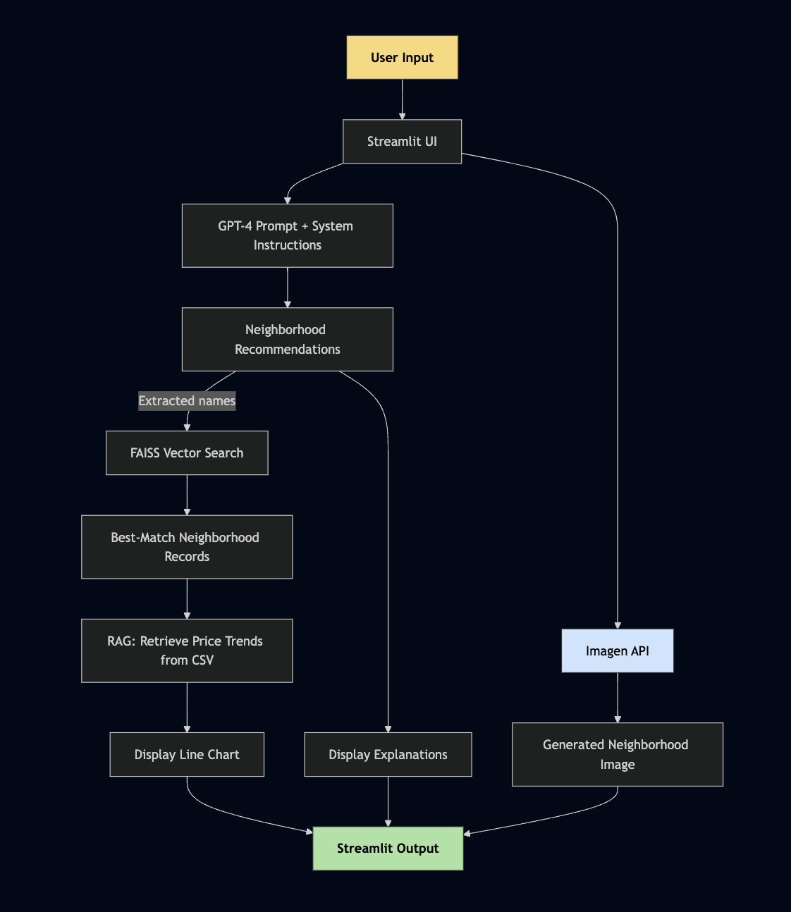
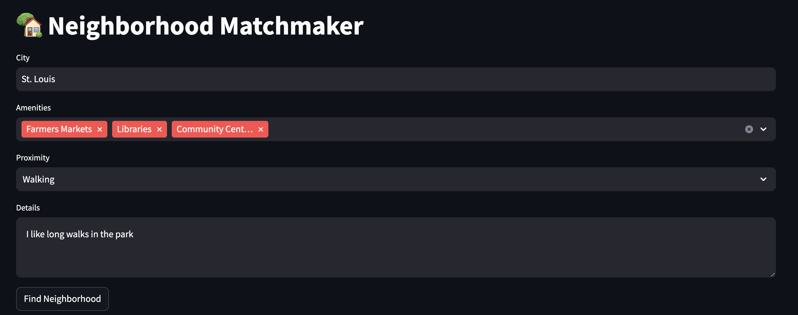
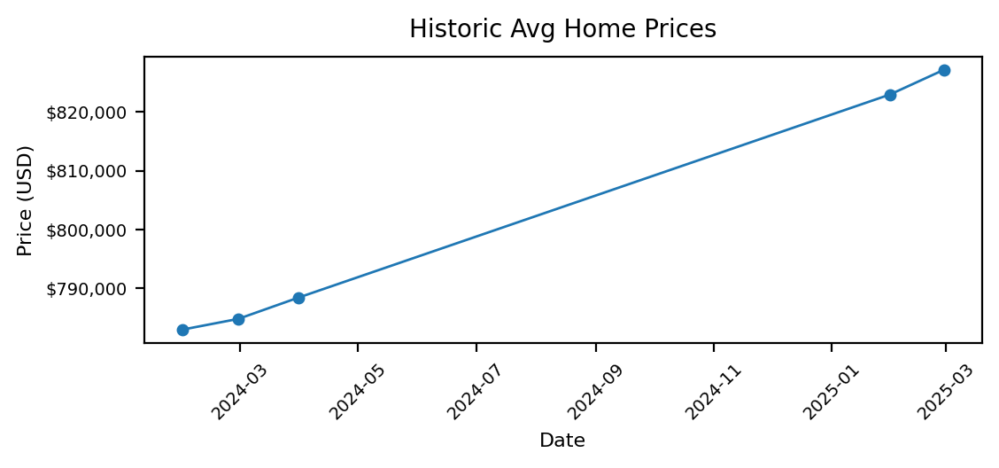

# Neighborhood Matchmaker

Neighborhood Matchmaker helps people find neighborhoods that match their lifestyle, not just their price range. Built with GPT-4, Zillow-based home data, and retrieval-augmented generation (RAG), this app delivers AI-powered recommendations that are actually grounded in local insights.

---

## Problem

Most real estate platforms filter listings by price, size, and commute. But for people who care about walkability, parks, libraries, or that intangible neighborhood “feel,” these platforms come up short.

Neighborhood Matchmaker solves that by combining AI with real data:
- Natural language input for lifestyle preferences
- RAG-based retrieval from Zillow pricing datasets
- FAISS vector search for semantic name matching
- Price trend visualizations and generative images to complete the story

---

## A Neighborhood is a Feeling

Real places aren’t just coordinates or prices, neighborhoods often times carry their own vibe.

This app aims to visualize and communicate that feeling, with LLM-powered narratives and generated previews of life in each place.

<div align="center">

📍 *Example: Neighborhood Image*  


</div>

---

## Core Features

- **AI Recommendations**: GPT-4 suggests neighborhoods based on amenities, proximity, and personal lifestyle prompts.
- **RAG Integration**: Home price trend data is pulled in real time from a cleaned Zillow dataset.
- **Semantic Search**: FAISS vector search ensures name matches are resilient and context-aware.
- **Visual Previews**: Artistic images (via Imagen or DALL·E) help capture the “vibe” of a place.
- **Streamlit Interface**: Interactive, intuitive, and runs either locally or via Docker.

---

## Architecture Overview

[data/architecture.mmd](data/architecture.mmd)  



Neighborhood Matchmaker uses a **RAG (Retrieval-Augmented Generation)** pattern enhanced with embeddings and vector search.


⸻

## Example Workflow

**Input**
- **City**: `St. Louis`
- **Preferences**: “I like long walks in the park”
- **Amenities**: `Farmers Markets`, `Libraries`, `Community Centers`
- **Proximity**: `Walking`

**Output**
- GPT recommends: `Webster Groves`, `Clayton`, `Kirkwood`
- For each neighborhood:
  - A narrative explanation
  - Specific addresses for key amenities
  - A price trend chart
  - An optional generated image

⸻

## 📺 Watch the Demo

Here’s a short walkthrough of the full app experience:

👉 [📺 Watch the Demo Video](https://github.com/dneish2/HoodMatcher/raw/main/output/matcherdemo.mp4)

⸻

1. Form Input: User Preferences




⸻

2. LLM Output: Raw JSON

```json
{
  "recommendations": [
    {
      "neighborhood": "Webster Groves",
      "explanation": "Webster Groves might be just what you're looking for. The neighborhood is home to the beautiful Blackburn Park where you could take those long walks. For your amenities, the Webster Groves Farmers Market, located in the heart of the town at the intersection of Big Bend Blvd and South Old Orchard Ave, offers an assortment of fresh local produce every Thursday. The Webster Groves Public Library on East Lockwood Avenue offers a multitude of resources, and the Webster Groves Recreation Complex on East Glendale Road is a perfect community center with a variety of programs for residents of all ages."
    },
  ]
}
```

⸻

3. Price Chart: Historical Trends (RAG output)




4. Generated Image: Neighborhood Vibe (Imagen)


⸻

## Installation

Option 1: Run Locally (Python + Streamlit)

# Clone the repo
git clone https://github.com/dneish2/HoodMatcher.git
cd HoodMatcher

# Install dependencies
pip install -r requirements.txt

# Set API keys
export OPENAI_API_KEY="your-key"
export GEMINI_API_KEY="your-key"  # optional, for image generation

# Run the app
streamlit run app.py

⸻

Option 2: Run with Docker

# Build the container
docker build -t hood-matchmaker .

# Run the app
docker run -p 8501:8501 \
  -e OPENAI_API_KEY="your-key" \
  -e GEMINI_API_KEY="your-key" \
  hood-matchmaker

Then open http://localhost:8501 in your browser.

⸻

Data Requirements

Neighborhood data should follow a similar format to housing-data-slim-2024.csv, including:
	•	RegionName, RegionType, Metro
	•	Month-end pricing columns in YYYY-MM-DD format

⸻

## File Structure

├── NeighborhoodMatcher.py
├── data/
│   ├── housing-data-slim-2024.csv
│   └── architecture.mmd
├── output/
│   ├── form_input.png
│   ├── home_prices.png
│   ├── llm_output.json
│   └── neighborhood.png
├── Dockerfile
├── requirements.txt
└── application_default_credentials.json

⸻

## API Configuration

To run the application successfully, you will need the following API credentials:

- **`OPENAI_API_KEY`** — Required for GPT-4 and text embeddings (e.g., `text-embedding-3-small`)
- **`GEMINI_API_KEY`** *(optional)* — Used for generating neighborhood images via Google Imagen
- **`GOOGLE_APPLICATION_CREDENTIALS`** *(optional)* — Path to your `application_default_credentials.json` file if using VertexAI

You can set these environment variables in your terminal:

```bash
export OPENAI_API_KEY="your-openai-key"
export GEMINI_API_KEY="your-gemini-key"
export GOOGLE_APPLICATION_CREDENTIALS="./application_default_credentials.json"
```
⸻

## Key Technical Challenges and Solutions

1. Home Pricing Retrieval — Transition from Fuzzy Matching to RAG

Problem:
Initially used fuzzy string matching (e.g., difflib) which broke on inconsistent real-world names.

Solution:
Adopted a full RAG setup using OpenAI embeddings + FAISS to enable semantic search over RegionName, allowing the LLM output to match reliably with the structured price data.

⸻

2. Zillow Dataset Integration — Managing Local Memory Constraints

Problem:
Full Zillow data caused memory crashes on 8GB local M1 machine.

Solution:
Downsampled and scoped the data to 2024+. Migrated dataset to BigQuery for file storage and modification.

⸻

3. Imagen API Integration — Credential and Config Management

Problem:
Imagen API didn’t pose a complex integration, but ensuring secure auth with application_default_credentials.json was essential.

Solution:
Standardized the GCP service account config and verified access within the Docker and local dev flows.

⸻

## Contributing

Pull requests are welcome. Please fork the repository and open a PR with clear documentation of any changes. Custom datasets or city expansions are encouraged.

⸻

## License

MIT License. See the LICENSE file for details.
